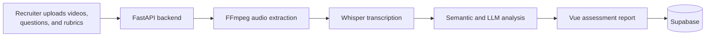

# TalentLens

TalentLens is an AI-assisted interview assessment platform. Recruiters can upload
candidate interview videos, attach a question and scoring rubric to each video,
and receive a structured report containing a transcript, answer score, fluency
score, pause analysis, and an AI-likeness indicator.

> AI-generated assessments are decision-support tools, not a replacement for
> human review. Do not use the scores as the sole basis for an employment
> decision.

## Features

- Upload and analyze multiple `.mp4` or `.webm` interview recordings
- English speech-to-text transcription with timestamped segments using Whisper
- Rubric-based answer evaluation and semantic similarity scoring
- Speech-fluency and pause analysis
- Experimental AI-likeness classification
- Candidate dashboard and detailed assessment reports
- Persistent report storage with Supabase

## How It Works



## Tech Stack

| Layer | Technology |
| --- | --- |
| Frontend | Vue 3, TypeScript, Vite, Tailwind CSS |
| UI | Reka UI, Lucide icons |
| Backend | Python, FastAPI, Uvicorn |
| Audio and transcription | FFmpeg, OpenAI Whisper |
| AI analysis | OpenAI-compatible API, Sentence Transformers |
| Database | Supabase |

## Project Structure

```text
.
├── backend/
│   ├── main.py                    # FastAPI application and /analyze endpoint
│   ├── models.py                  # API response models
│   ├── services/
│   │   ├── audio_processor.py     # Audio extraction and transcription
│   │   ├── analysis_service.py    # Scoring and fluency analysis
│   │   └── llm_service.py         # LLM and embedding integration
│   └── requirements.txt
└── frontend/
    ├── src/
    │   ├── components/
    │   ├── services/
    │   └── views/
    └── package.json
```

## Prerequisites

- Node.js `20.19+` or `22.12+`
- npm
- Python 3.10+
- FFmpeg available on your system `PATH`
- A Supabase project
- Your own API key for the OpenAI-compatible service configured by the backend

Whisper's `medium` model and the sentence-transformer model are downloaded when
the backend first runs. The initial startup and analysis can therefore take
longer and require several gigabytes of disk space.

## Local Setup

### 1. Clone the repository

```sh
git clone <repository-url>
cd "hr interview"
```

### 2. Configure Supabase

Create these two tables in your Supabase project:

- `assessments`: `id`, `candidate_name`, `position`, `total_videos`,
  `generated_at`, and `created_at`
- `assessment_videos`: `id`, `assessment_id`, `video_sequence`, `file_path`,
  `question`, `final_score`, `rubric_reason`, `fluency_score`,
  `ai_likeness_label`, `ai_silence_score`, `full_transcript`, `segments`,
  `pauses`, and `duration_sec`

`assessment_videos.assessment_id` should reference `assessments.id`. Use JSON or
JSONB columns for `segments` and `pauses`, and configure Supabase Row Level
Security policies appropriate for your application before exposing it publicly.

### 3. Run the backend

```sh
cd backend
python -m venv .venv
```

Activate the virtual environment:

```powershell
# Windows PowerShell
.\.venv\Scripts\Activate.ps1
```

```sh
# macOS or Linux
source .venv/bin/activate
```

Install the dependencies, add your own API key in the local env file, and start FastAPI:

```sh
pip install -r requirements.txt
```

```powershell
# Windows PowerShell
# Drop your API key in backend/.env
uvicorn main:app --reload --host 0.0.0.0 --port 8000
```

```sh
# macOS or Linux
# Drop your API key in backend/.env
uvicorn main:app --reload --host 0.0.0.0 --port 8000
```

The API will be available at `http://localhost:8000`, with interactive
documentation at `http://localhost:8000/docs`.

### 4. Run the frontend

Open a second terminal:

```sh
cd frontend
cp .env.example .env
npm install
npm run dev
```

On Windows PowerShell, copy the environment template with:

```powershell
Copy-Item ".env.example" ".env"
```

Update `frontend/.env` by dropping your own values there:

```env
VITE_API_URL=http://localhost:8000
VITE_SUPABASE_URL=https://your-project.supabase.co
VITE_SUPABASE_PUBLISHABLE_KEY=drop-your-supabase-publishable-key
VITE_SUPABASE_ANON_KEY=drop-your-supabase-anon-key
```

Open `http://localhost:5173`. If the frontend and backend use different origins,
configure an allowed CORS origin in FastAPI or route API requests through a
same-origin proxy.

## API

### `POST /analyze`

Send a `multipart/form-data` request containing:

| Field | Description |
| --- | --- |
| `files` | One or more interview video files |
| `metadata` | JSON string with matching `questions` and `rubrics` arrays |

Example metadata:

```json
{
  "questions": ["Tell us about a difficult problem you solved."],
  "rubrics": ["Explains the context, actions, reasoning, and measurable result."]
}
```

The number of files, questions, and rubrics must match.

## Available Commands

From the `frontend` directory:

| Command | Purpose |
| --- | --- |
| `npm run dev` | Start the Vite development server |
| `npm run build` | Type-check and create a production build |
| `npm run preview` | Preview the production build |
| `npm run lint` | Run ESLint and apply safe fixes |
| `npm run format` | Format frontend source files |

## Security Notes

- Never commit API keys or Supabase service-role keys.
- Keep only publishable/anonymous Supabase keys in frontend environment files.
- Drop your own API values in local `.env` files only.
- Rotate any credential that has previously been committed to source control.
- Validate upload type and size, add authentication, and review database policies
  before using the project in production.
- Treat the AI-likeness result as experimental; it does not prove that an answer
  was generated by AI.

## Team

This project is developed by:

| Name | Role |
| M Adam Abdurahman | Backend & Frontend | 
| Steven Lie Wibowo | Data Preprocessing | 
| Muhammad Zaki Alfadilah | Modelling | 

## License

No license has been specified yet. Add a `LICENSE` file before distributing or
reusing the project.
